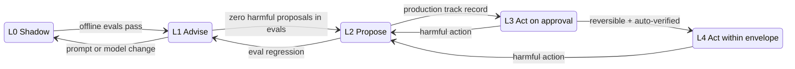

# The Agent Autonomy Ladder

A governance design for AI agents in the delivery pipeline: what each agent is
allowed to do, what evidence earns it more, and what takes it away.

**Status:** draft for discussion · **Scope:** agents that review, fix, deploy
or audit software · **See also:** [failure-agent evals](https://github.com/himohann-cpu/outerloop-pipeline/tree/main/evals)

## 1. The problem

Every team adopting agents ends up arguing about the same question: *should we
let it do that on its own?* The argument usually runs on instinct. One bad
auto-merge and the answer becomes "never"; one impressive demo and it becomes
"why not".

Both answers are wrong for the same reason. Autonomy is treated as a property
of the agent ("the fix bot is trusted"), when it should be a property of an
**action**, granted on **evidence**, and **revocable without a meeting**.

This design makes that concrete with three things:

1. A ladder of five autonomy levels with a clear definition of each.
2. Promotion gates based on measured results, not on confidence in the model.
3. Automatic demotion triggers, so trust is lost as fast as it should be.

## 2. The ladder

| Level | Name | What the agent does | Who decides | Example |
|---|---|---|---|---|
| L0 | Shadow | Runs on real inputs; output is stored and shown to no one | Nobody acts on it | Backtest against closed tickets |
| L1 | Advise | Posts findings: comments, reports, summaries | A human does all the work | PR review comment, failure diagnosis |
| L2 | Propose | Creates a reviewable artifact that can be thrown away: a branch and PR, a ticket, a draft change | A human accepts or rejects the artifact | Auto-fix PR |
| L3 | Act on approval | Executes the change itself after a named human approves that specific action | A human approves each action | Rollback after an on-call click |
| L4 | Act within envelope | Executes a pre-approved class of action with no per-action approval; humans are notified and audit a sample | The policy decides; humans review after | Auto-merge a patch-level dependency bump |



There is deliberately no level where the agent acts and nobody is told.

## 3. What a level is granted to

A level is granted to a triple, never to an agent as a whole:

> **(agent, action class, target tier)**

The same failure-fix agent can sit at L4 for "re-run a flaky job", L2 for
"patch application code" and L1 for "anything touching IAM". Granting by agent
alone is how a bot trusted to fix lint ends up editing a deployment manifest.

### Blast radius sets the ceiling

Each action class has a ceiling: the highest level it may ever reach, however
good the agent's record. I score the ceiling on three questions.

| Question | Low | High |
|---|---|---|
| **Reversibility:** how long to undo it? | Minutes, automatically | Hours, or not at all |
| **Scope:** how much does one action touch? | One repo or service | Many, or shared infrastructure |
| **Exposure:** what does a mistake reach? | Internal, non-production | Production, customer data, or a security control |

My default ceilings:

| Action class | Ceiling | Why |
|---|---|---|
| Comments, labels, summaries, docs | L4 | Trivially reversible, no runtime effect |
| Re-run a job, quarantine a flaky test | L4 | Reversible; a deterministic check confirms the result |
| Patch-level dependency bump with passing tests | L4 | Small, common, and verified by the test suite |
| Fix to application code | L3 | Tests verify behaviour, but only what they cover |
| CI config, Dockerfile, infrastructure as code | L3 | A wrong change can pass every test and still break delivery |
| Roll back a stateless service to last known good | L4 | Reversible by design, and speed matters most here |
| Forward deploy to production | L3 | A human owns the release decision |
| Schema migration, data deletion | L2 | Not reversible |
| IAM, secrets, branch protection, audit evidence | L1 | The agent must never be able to alter the controls that constrain it |

The last row is the one I hold hardest. An agent that can change its own
guardrails has no guardrails.

## 4. Promotion gates

Promotion needs evidence of a kind that matches the risk of the next level.
The numbers below are starting points; calibrate them against your own
history before relying on them.

| Promotion | Evidence required |
|---|---|
| **L0 → L1** | Offline evals meet the accuracy bar. Cost per run is within budget. Outputs carry the deterministic facts they are based on. |
| **L1 → L2** | On the eval suite, across at least 3 trials: **zero** harmful proposals, and correct abstention on every case that has no valid fix. Shadow-mode output agrees with what humans did on a sample of real cases. The agent has its own identity with least-privilege permissions, and the kill switch has been tested. |
| **L2 → L3** | A production record: at least 50 proposals, at least 80% accepted without edits, no reverts traced to the agent in 30 days. A deterministic check exists that can confirm the action worked. |
| **L3 → L4** | At least 100 approved actions in this class with no human override. The action is reversible automatically, a deterministic post-check runs every time, and a sampled human audit is scheduled. The action class ceiling allows L4. |

Two rules apply to every gate:

- **The metric that matters is the harmful rate, not the success rate.** A
  missed fix costs a person a few minutes. A plausible, wrong change costs
  review time and trust. An agent that is right 70% of the time and silent the
  rest is more promotable than one that is right 90% and wrong 10%.
- **Promotion is a recorded decision with a named owner.** Section 8 has the
  template.

## 5. Demotion triggers

Demotion is automatic. Nobody should have to win an argument to take autonomy
away from a system that just caused harm.

| Trigger | Effect |
|---|---|
| A harmful action at L3 or L4 | That action class drops to L2 immediately |
| Eval results fall below the gate for the current level | Drop one level until they recover |
| The prompt, model, or tool set changes | Drop to the level below until evals are re-run on the new version |
| Human override or rejection rate exceeds the gate over a rolling window | Drop one level |
| Cost or action budget exceeded | Run halts; level is unchanged, but the incident is logged |
| A gap in the audit trail | All of that agent's grants drop to L1 |

The third trigger is the one teams skip. A model upgrade is a new agent with
the old agent's permissions. The eval harness in `outerloop-pipeline` ties
every saved result to a fingerprint of the prompt for this reason: change the
prompt and the old evidence no longer counts.

## 6. Controls required at every level

A level describes what an agent may do. These controls describe what must be
true around it. Each one is enforced by code or platform configuration, never
by the prompt.

| Control | Requirement |
|---|---|
| **Identity** | Each agent has its own identity (for example a GitHub App), so its actions are attributable and revocable on their own |
| **Permissions** | Scoped to the action class. Write access is limited to the agent's own namespace: its own branches, its own tickets |
| **Budgets** | A hard cap per run on spend, model turns, and number of write actions |
| **Kill switch** | One setting that stops all writes for an agent, tested before any promotion past L1 |
| **Audit** | Every tool call recorded with a hash of its input and output, stored where the agent cannot write |
| **Input trust** | Text from PRs, commits, logs and tickets is marked as untrusted data and cannot change the agent's instructions |
| **Fallback** | If the model is unavailable or over budget, the surrounding process still completes on a deterministic path |
| **Policy check** | Every write passes through one deterministic function that answers: is this agent allowed this action class on this target at its current level? |

## 7. Where my own agents sit

Applying the ladder to the work in my repos shows both the pattern and the gaps.

| Agent | Level today | What already fits | Gap |
|---|---|---|---|
| PR review agents (`outerloop-pipeline`) | L1 | Read-only on code; posts one combined comment; reports its own LLM cost | The orchestrator exits non-zero when any agent returns `FAIL`, so a model verdict can block a merge. That is a veto, which L1 does not include. It should be advisory unless the `FAIL` is backed by a deterministic finding. |
| Failure auto-fix agents (`outerloop-pipeline`) | L2 | Patch must pass `git apply --check`; pushes only to `agent-fix/*`; PR body says to review before merging | The workflow grants `contents: write` to every job, wider than the fix job needs. Until the eval harness existed there was no measured basis for being at L2 at all. |
| SOC 2 compliance agents (`AI-Thoughts`) | L1, plus a narrow L2 for tickets | GitHub client is GET-only; tickets only for failures from the current run, capped at 15, on records the agent owns; every tool call hashed; the control never depends on the model | Nothing to fix. This is the reference implementation of "ceiling L1 for controls". |
| Bug-fix workflow (`AI-Thoughts`, design) | L2 | Confidence gates at each stage; fix confidence capped by diagnosis confidence; no path merges without a human | Confidence is self-reported against a rubric. Promotion past L2 should rest on calibration results, which the design already calls for in shadow mode. |

## 8. Policy as code

The ladder only works if it is enforced where the action happens. A policy
file in the repo states the grants; a deterministic check reads it before any
write.

```yaml
# .agents/autonomy.yml
agents:
  failure-fix:
    identity: app/outerloop-fix-bot
    budgets: { usd_per_run: 0.50, writes_per_run: 1 }
    kill_switch: vars.AGENT_FAILURE_FIX_ENABLED
    grants:
      - action: rerun_job
        target: [ci]
        level: L4
      - action: patch_app_code
        target: [app/**]
        level: L2
        requires:
          evals: { harmful_pr_rate: {max: 0.0}, abstention_accuracy: {min: 1.0} }
          max_diff_lines: 150
      - action: patch_delivery_config
        target: [Dockerfile, .github/**, scripts/**]
        level: L1          # diagnose only

ceilings:
  patch_app_code: L3
  patch_delivery_config: L3
  change_access_control: L1
```

Enforcement points:

| Level | Enforced by |
|---|---|
| L1 | Token with read and comment permission only |
| L2 | Branch ruleset restricting the agent's identity to its own branch prefix; no merge permission |
| L3 | A protected environment with required reviewers; the agent's job waits for the approval |
| L4 | The policy check plus a deterministic post-check; failure of the post-check triggers the rollback and the demotion |

### Promotion record

Every change of level is a pull request against `autonomy.yml` with this in
the description:

```markdown
**Grant:** failure-fix / patch_app_code / app/** : L2 → L3
**Owner:** <name>
**Evidence:** eval run <link>, 3 trials, harmful_pr_rate 0%, pr_precision 92%
**Production record:** 64 PRs, 55 merged unedited, 0 reverts in 30 days
**Rollback:** revert this PR; kill switch AGENT_FAILURE_FIX_ENABLED
**Review date:** <date + 90 days>
```

The numbers in that example are placeholders showing the shape of the record.

## 9. Measuring the programme

| Metric | Question it answers |
|---|---|
| Harmful action rate, per action class | Is any grant too high? |
| Acceptance rate without edits | Is L2 ready to become L3? |
| Human override rate at L3 and L4 | Is the envelope drawn in the right place? |
| Time from proposal to human decision | Is review the bottleneck the agent was meant to remove? |
| Cost per accepted action | Is the agent worth running at this level? |
| Share of grants with evidence younger than 90 days | Is the trust current, or inherited? |

## 10. Anti-patterns

- **Trust by tenure.** "It has been running for months" is not evidence if
  nobody measured what it did.
- **Autonomy by agent.** One grant covering every action an agent can take.
- **The prompt as a guardrail.** "Never push to main" in a system prompt,
  with a token that can push to main.
- **A model with a veto.** An LLM verdict that blocks a merge or a deploy with
  no deterministic finding behind it.
- **Silent upgrades.** Swapping the model and keeping the grants.
- **Approval fatigue.** Sending so many L3 approvals that humans click through
  them. That is L4 without the evidence.

## 11. Open questions

- How large an eval suite is enough to justify L2 for a new action class?
- Should an L4 grant expire on a fixed schedule even with a clean record?
- When two agents act on the same change, whose level applies: the lower one,
  or a separate grant for the pair?
- How should a sampled audit at L4 be sized so that a 1% harmful rate is
  actually detectable?
