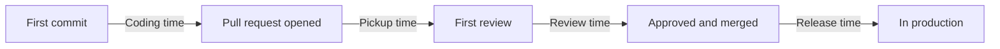

# Measuring AI's Impact on Delivery

A design for answering the question every engineering leader is now asked:
*we are paying for AI tools and agents; is delivery actually better?*

**Status:** draft for discussion · **Scope:** AI coding assistants and agents
used in building, reviewing, testing and operating software

## 1. Why this is hard

The honest answer is usually "we don't know", for four reasons.

**Feeling faster is not being faster.** In a 2025 controlled study by METR,
16 experienced open-source developers completed 246 tasks with and without AI
tools. They believed AI made them about 20% faster. Measured, they were 19%
slower. Whatever that result says about any particular tool, it says a lot
about self-reported time savings: they cannot be the evidence.

**A faster step is not a faster system.** Writing code is one stage of
delivery. If code arrives faster but review, testing and release do not
change, the work piles up at the next stage and lead time stays where it was.

**Speed and stability move separately.** DORA's 2024 report associated rising
AI adoption with an estimated 1.5% drop in delivery throughput and a 7.2%
drop in delivery stability, with larger change sizes suggested as one cause.
Its 2025 report found throughput now improving with AI adoption while
instability continued to rise, and described AI as an amplifier of whatever
an organisation already is. A measurement that watches only speed will miss
the half of the picture that hurts.

**Everything else is changing too.** Teams reorganise, platforms improve,
priorities shift. A before-and-after comparison credits AI with all of it
unless the design rules that out.

## 2. Principles

1. **Measure the system, not the person.** The unit is a team or a service.
   Nothing here is reported for an individual.
2. **Baseline first.** Without a "before" there is no "after".
3. **Pair every speed metric with a quality metric.** A speed number is never
   shown without the one that would reveal what it cost.
4. **Measure outcomes, not activity.** Changes delivered and incidents
   avoided, not suggestions accepted or lines produced.
5. **Count the cost.** Licences, tokens, and the review time AI output
   consumes.
6. **Say what you could not measure.** A gap in the data is reported as a gap.

## 3. What to measure

### 3.1 Delivery: the DORA measures

| Measure | Question | Paired with |
|---|---|---|
| Deployment frequency | How often does a change reach production? | Change failure rate |
| Lead time for changes | How long from first commit to production? | Rework rate |
| Change failure rate | What share of deployments cause a failure? | Deployment frequency |
| Time to restore | How long to recover when one does? | Incident count |
| Rework rate | What share of deployments exist only to fix an earlier one? | Lead time |

These come first because they are about the whole system, they are widely
understood, and most teams can compute them from data they already have.

### 3.2 Where the time goes

Lead time as a single number hides where AI helped and where the work moved
to. Split it into stages and watch each one.

| Stage | What AI is expected to do | What to watch for |
|---|---|---|
| Coding time | Shorten it | Whether it actually shortens |
| Pickup time | Nothing | Growth, as more and larger pull requests wait for a reviewer |
| Review time | Shorten it, with AI review | Growth, if reviewers read generated code more carefully |
| Release time | Nothing, unless agents work here | It becoming the largest share once coding is faster |

Three supporting measures explain movements in those stages:

| Measure | Why it matters |
|---|---|
| Pull request size | Larger changes are riskier and slower to review. Growth here is the early warning. |
| Review load per reviewer | Shows whether the bottleneck has moved onto a few people |
| Work in progress | Rising while throughput is flat means the system is clogging |

### 3.3 Quality

| Measure | Definition |
|---|---|
| Change failure rate | From 3.1; the headline |
| Revert rate | Share of merged changes reverted or substantially rewritten within 14 days |
| Escaped defects | Defects found in production per 100 changes |
| Incident count and severity | Per service, per month |

Revert rate is the fastest signal of the four. Incidents take weeks to show a
pattern; reverts show one in days.

### 3.4 The AI itself

| Measure | Definition | Why |
|---|---|---|
| Involvement | Share of changes with AI assistance | Without it, no comparison is possible |
| Accepted without edits | Share of agent output a person merged as it was | Whether the output is usable |
| Rejection rate | Share of agent output failing a deterministic check | Whether guardrails are doing work |
| Harmful action rate | Agent actions that had to be undone | The safety number |
| Cost per useful result | All AI spend divided by results someone used | The only cost figure that includes the failures |

### 3.5 People

A short quarterly survey, at team level: satisfaction with tools, time spent
on toil, confidence in the code being shipped, and on-call load. Surveys are
the right tool for how work *feels*. Section 1 is why they are the wrong tool
for how long it *takes*.

## 4. How to compare

### 4.1 Tag the work

No comparison is possible unless each change records whether AI was involved.
Use a pull request label or a commit trailer, set by the tool where possible
and by the author where not. Three values are enough:

| Tag | Meaning |
|---|---|
| `ai:none` | Written without AI assistance |
| `ai:assisted` | A person wrote it with AI help |
| `ai:agent` | An agent produced it; a person reviewed it |

Tagging by hand is imperfect. Report the share of untagged changes alongside
every result, so the reader can see how much the comparison rests on.

### 4.2 Three designs, weakest to strongest

| Design | How | Weakness |
|---|---|---|
| Before and after | Same teams, 8 to 12 weeks before adoption against 8 to 12 weeks after | Credits AI with everything else that changed |
| Staggered rollout | Teams adopt in waves; later waves are the comparison for earlier ones | Needs several teams and patience |
| Within-team comparison | Same team, same period: tagged AI changes against untagged ones | AI gets used on easier work, which flatters it |

Use the staggered rollout when you can. When you cannot, run the other two
together and trust a result only where they agree.

### 4.3 Compare like with like

A dependency bump and a new payment flow are different work. Segment by
change type (feature, fix, refactor, dependency, configuration) and compare
within a segment. An overall average mostly reports that the mix of work
changed.

### 4.4 Wait

The first weeks after adoption show a dip while people learn, then a rise
while the novelty lasts. Neither is the answer. Exclude the first four weeks
and measure at least eight after them.

### 4.5 Report a range

"Lead time fell 12%" on six weeks of data from four teams is a guess stated
as a fact. Report the range the data supports, and say plainly when the range
includes zero.

## 5. What not to measure

| Do not measure | Because |
|---|---|
| Lines of code, or share of code written by AI | More code is a cost. This rewards the wrong thing. |
| Pull requests or commits per developer | Trivially inflated, and it turns a team measure into a personal one |
| Suggestion acceptance rate, as a goal | It measures agreement with the tool, not the value of the result |
| Self-reported hours saved, as the return | People overestimate it; see section 1 |
| AI usage, as a target | Once usage is the target, people use it where it does not help |
| Individual productivity rankings | Destroys the trust the measurement depends on, and gets gamed within a quarter |
| Story points delivered | Estimates drift upward as soon as they are watched |

Some of these are worth *looking at* for diagnosis. None should be a target
or a headline.

## 6. Reading the results

| Throughput | Stability | Likely meaning | Do |
|---|---|---|---|
| Up | Flat or up | It is working | Extend to more teams; keep measuring |
| Up | Down | Changes are arriving faster than they can be checked | Cap change size, strengthen automated checks, slow the rollout |
| Flat | Flat | Coding was not the bottleneck | Look at the stage times in 3.2 and aim AI at the slowest one |
| Flat | Down | Cost with no benefit | Stop and find out why before spending more |
| Down | Any | Learning curve, or a poor fit for this work | Check whether it is past the first four weeks; if so, reconsider |

The second row is the one to expect, and the one a speed-only dashboard
reports as a success.

## 7. Reporting it

One page, each quarter, for the people who fund it.

| Section | Content |
|---|---|
| Three numbers | Lead time, change failure rate, cost per useful result. Each with its trend and its range. |
| What moved | One or two sentences on which stage got faster and which got slower |
| What it cost | Licences, tokens, and the change in review hours |
| What we cannot say yet | The untagged share, the confounders, anything under the minimum sample |
| Decision asked for | Extend, hold, or stop |

The fourth section is what makes the first three credible.

## 8. The first 90 days

| When | Do |
|---|---|
| Weeks 1 to 2 | Agree the measures and definitions. Start tagging. Confirm the four DORA measures can be computed from existing data. |
| Weeks 1 to 8 | Collect the baseline. Change nothing else on purpose. |
| Week 9 | First wave of teams adopts |
| Weeks 9 to 12 | Learning period. Watch revert rate and pull request size only. |
| Week 13 onward | Start the comparison. First report at week 21. |

Starting to measure after adoption is the most common mistake, and it cannot
be repaired afterwards.

## 9. Limits and open questions

- Attribution will never be clean. The aim is a defensible estimate with an
  honest range, not proof.
- Tagging depends on people and tools being consistent, and will undercount.
- Small organisations may never reach a sample large enough for a staggered
  rollout. A before-and-after with stated caveats is still better than
  nothing.
- How should the review time that AI output consumes be priced, when it
  falls on the most senior people?
- What is the right window for revert rate, given that some AI-introduced
  defects surface months later?

## Sources

- [2024 DORA report: AI adoption and delivery performance (InfoQ)](https://www.infoq.com/news/2024/11/2024-dora-report/)
- [2025 DORA State of AI-assisted Software Development report (InfoQ)](https://www.infoq.com/news/2025/09/dora-state-of-ai-in-dev-2025)
- [METR study on AI and experienced developers (Axios)](https://www.axios.com/2025/07/15/ai-coding-productivity-study)
